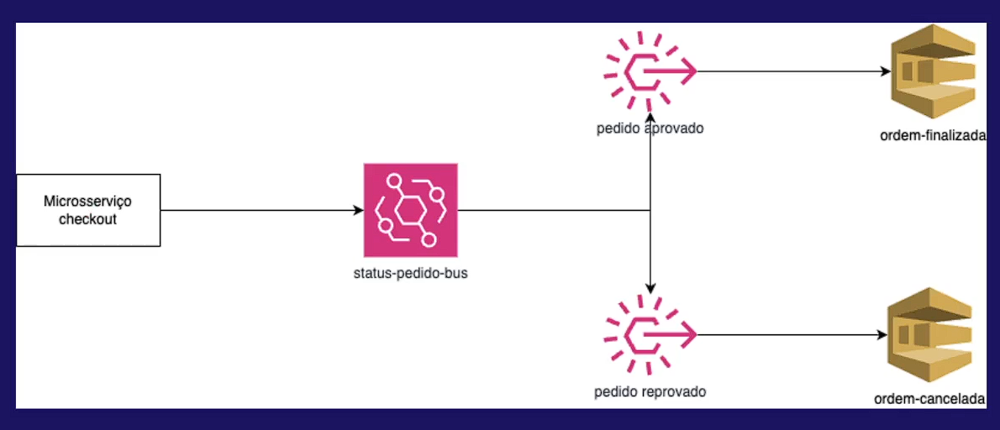

# ms-checkout

### microserviço desenvolvido para o workshop de arquitetura orientada a eventos da linuxtips

## Arquitetura

## Recursos utilizados da aws

* Eventbridge
* SQS
* IAM
* SDK

## Links

[Linuxtips - arquitetura-orientada-a-eventos-com-java-spring-e-aws](https://www.linuxtips.io/course/arquitetura-orientada-a-eventos-com-java-spring-e-aws)